MandarinBuddy is a Chinese learning app for iOS and web: spaced-repetition flashcards with an AI tutor.
Built for personal use. Currently hosted on `https://superanki-web.onrender.com/` and `https://superanki-server.onrender.com/`, but password protected.

<p align="center">
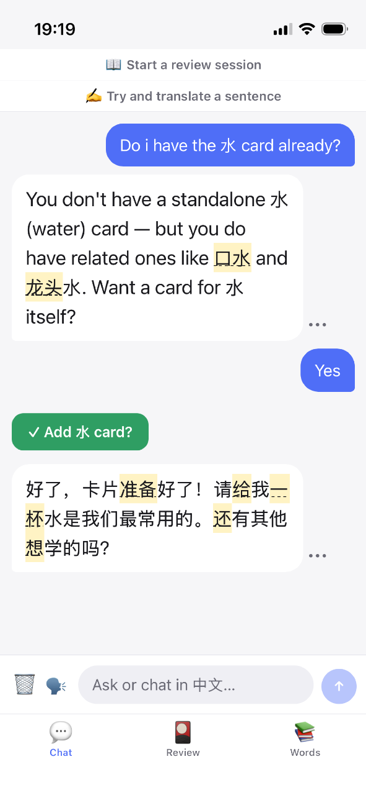
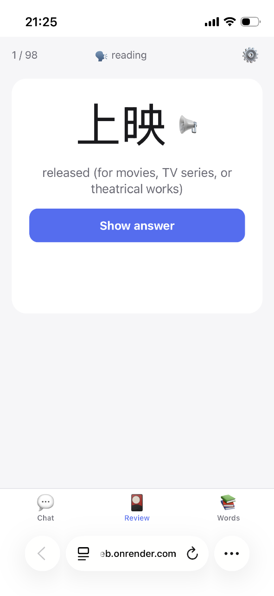
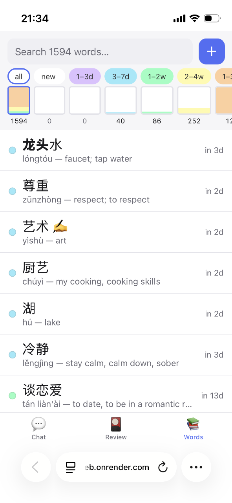
</p>

## Contents

- [Tech stack](#tech-stack)
- [Features](#features)
  - [💬 Chat screen](#-chat-screen)
  - [🔁 Review screen](#-review-screen)
  - [📚 Words screen](#-words-screen)
- [Run it](#run-it)
- [Game-ification](#game-ification)
- [Chinese-targeted features](#chinese-targeted-features)
- [Settings](#settings)
- [License](#license)

# Tech stack

<p align="center">
  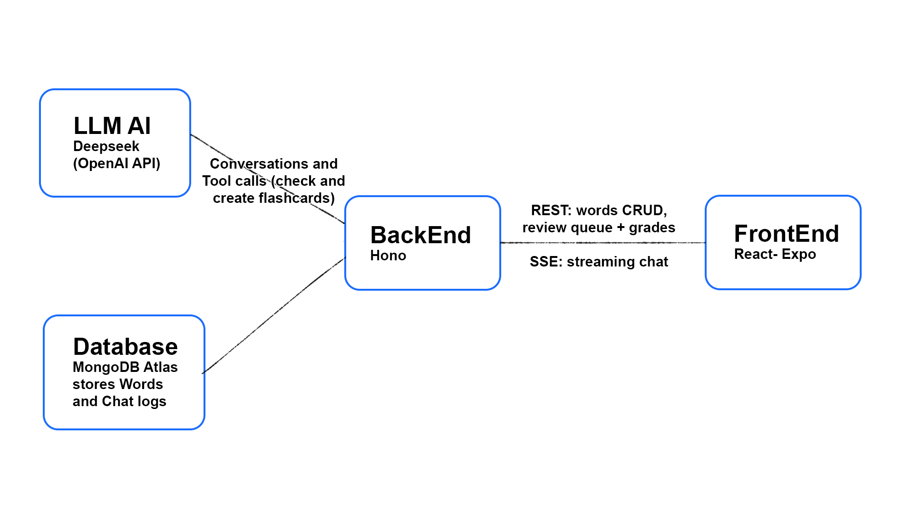
</p>

One TypeScript codebase:

- `app/` — Expo (React Native). The iPhone app **and** the website.
- `server/` — small Hono API: words CRUD, SRS review grading, Deepseek chat proxy (SSE).
- `shared/` — types and tools used by both.
- `old/` — old 2018 version of the project in pure HTML and JS, kept only for legacy reasons

Words and chat logs live in the same MongoDB (`words` and `chats` collections).

# Features

Three main tabs: Chat, Review, Words.

## 💬 Chat screen


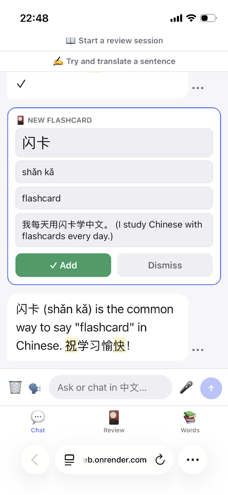

**AI tutor**: chats with you and can look up or create flashcards on the fly. DeepSeek (`deepseek-chat`, OpenAI-compatible API), streamed over **SSE**.

**Deck-aware**: your own vocabulary is fed to the model so it steers conversation toward the words you're learning.

**Chat feeds the SRS**: known words are highlighted — tap one for its definition (marks it forgotten); use one correctly yourself and it marks as remembered.

**Dictation** (🎤): free Web Speech API, web build only.

<br clear="both" />

## 🔁 Review screen

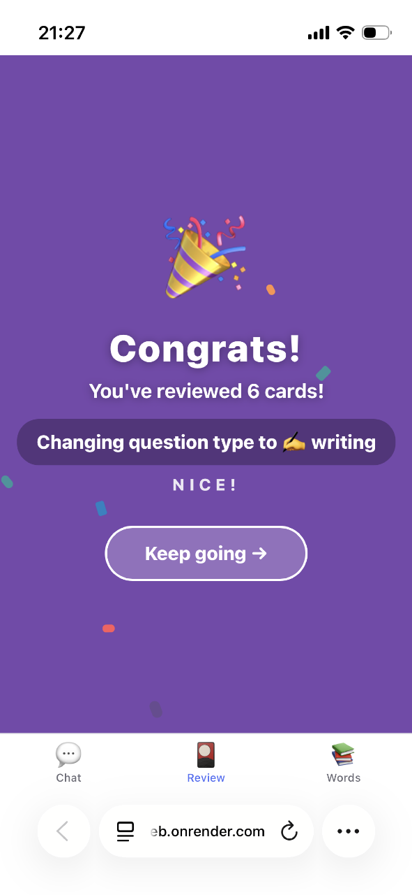
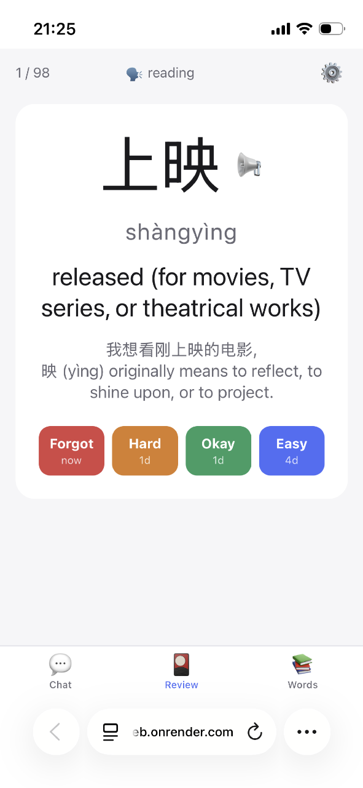

**Three Aspects**: for each word, Meaning, Reading and Writing.

**Review**: due words, scheduled by SRS. Two modes: **Direct typed input** or **Flip the card** (this is set per aspect in the Settings). There's also the option to **Both**, where a word starts as a _flip card_ then switches to _typed input_ once it's familiar enough.

**Auto-read**: words are read by default using Google Translate's public voice, proxied through the server at `/api/tts`. Chat messages are also read this way. Falls back to the device voice (`expo-speech`).

**Scaffold learning**: young cards come with training wheels — extra hints that drop away as the card matures.

<br clear="both" />

## 📚 Words screen


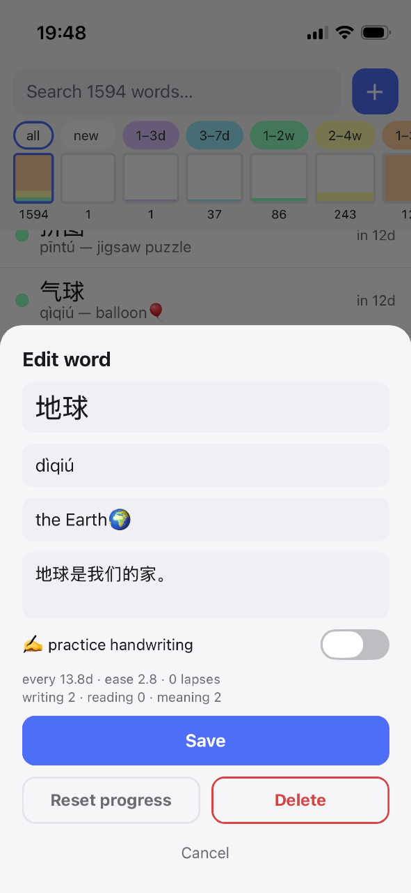

**CRUD + search** over the deck, with color-coded interval buckets.

**Scheduling**: an SM-2 variant (Anki-style) — ease, intervals, lapses — tracked per word, with separate mastery stats for meaning, reading and writing.

<br clear="both" />

# Run it

**Server** (terminal 1):

```sh
cd server
npm install
npm run dev          # http://localhost:6767
```

`server/.env` needs `MONGODB_URI` and `DEEPSEEK_API_KEY`
(required for the Chat tab; words/review work without it). (see server/.env.example)

**App** (terminal 2):

```sh
cd app
npm install
npm start          # then: press w for web, or scan the QR with Expo Go on iPhone
```

On the phone, the app auto-targets port 6767 on the same machine as the Metro
bundler — no config needed on the same WiFi. To point elsewhere, set
`EXPO_PUBLIC_API_URL=https://your-server` when starting.

# Game-ification


A few design choices meant to make the language learning process more pleasant and fun.

**Snappy UI**: this first came for free. Contrary to apps like Duolingo, there are no animations, no mascot, no chest or rewards to open. The time lost between reviews is minimal and the feedback is instant.

**Batch Size**: learning sessions are made more digestible by allowing the user to choose the size of the batches (in the settings). After finishing one batch, the user is met with a Breather Screen.

**Breather screen**: each batch ends on a congratulation screen (confetti and fireworks). It's a checkpoint as much as a reward — quitting mid-card loses that card's grade, so there's always a reason to push to the next one.

<br clear="both" />

# Chinese-targeted features

**Reading**: Chinese characters don't tell you how they're pronounced, so alongside Meaning and Writing, Reading is tested by typing pinyin.

**Practice Handwriting**: Some characters are very complex to learn how to handwrite (建筑), others are easy and worth the trouble (水). A per-word toggle marks which ones should be written with strokes rather than pinyin. It's a visual cue only — nothing is enforced, and you type with the device keyboard, so you need a Chinese keyboard installed.

**Fuzzy pinyin**: optional leniency on tones for Reading tests.

# Settings

<p align="center">
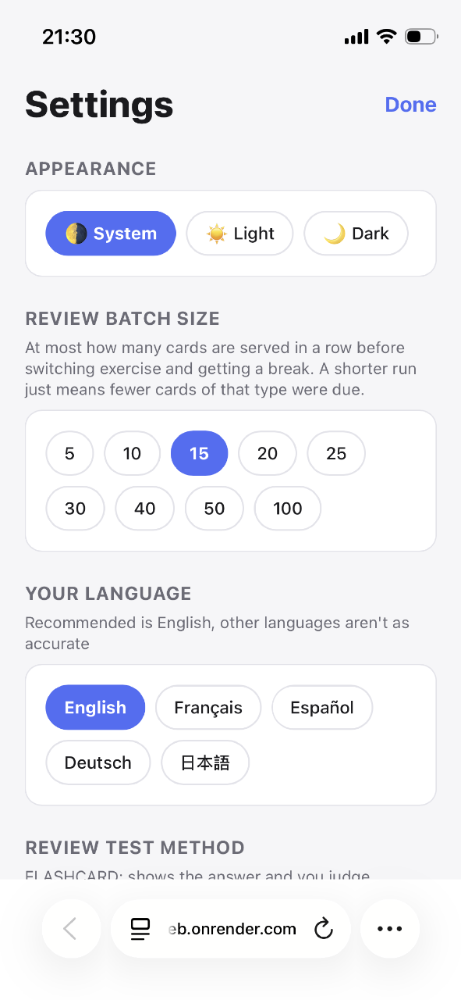
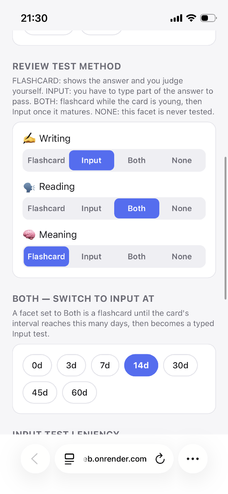
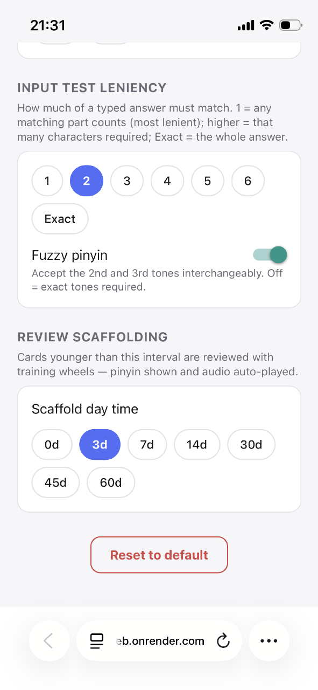
</p>
